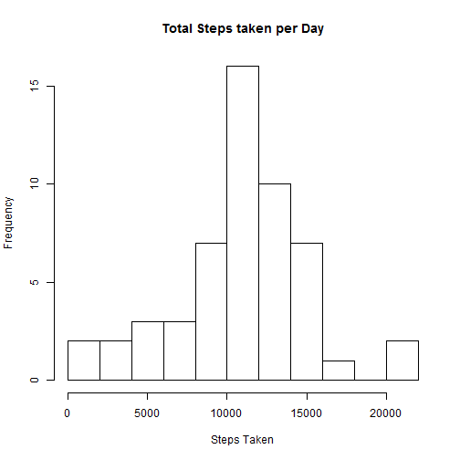
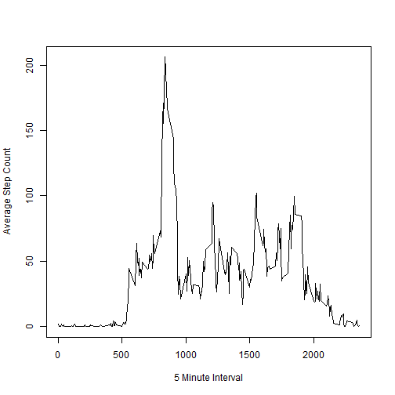
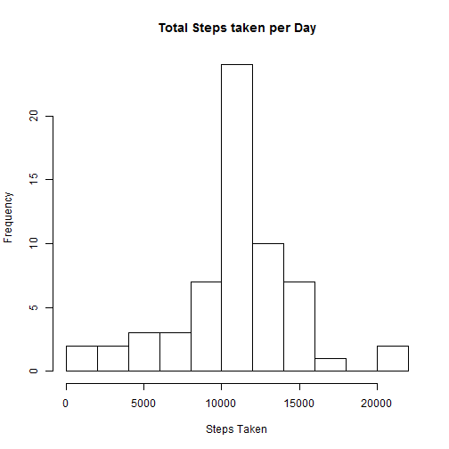
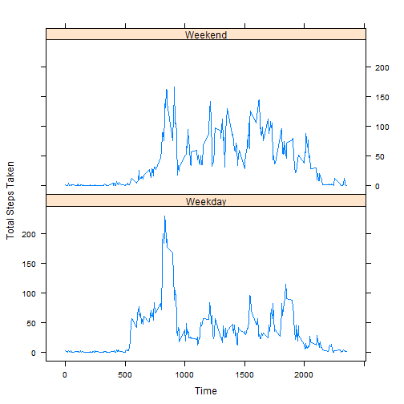

##Loading and preprocessing the data
Firstly, load all the required libraries as well as the dataset **"activity.csv"** and convert the columns into their proper classes.
all NA values are also omitted for this first part of the assignment.


```r
library(plyr)
library(lattice)

base<-read.csv("activity.csv")
base$date<-as.Date(base$date)
baseData<-na.omit(base)
head(baseData)
```

```
##     steps       date interval
## 289     0 2012-10-02        0
## 290     0 2012-10-02        5
## 291     0 2012-10-02       10
## 292     0 2012-10-02       15
## 293     0 2012-10-02       20
## 294     0 2012-10-02       25
```

##What is mean total number of steps taken per day?
In order to calculate the total number of steps taken per day, the **ddply** function is used.


```r
totalByDay<-ddply(baseData,.(date),colwise(sum))
head(totalByDay,3)
```

```
##         date steps interval
## 1 2012-10-02   126   339120
## 2 2012-10-03 11352   339120
## 3 2012-10-04 12116   339120
```

Below is the histogram created by the above **totalByDay** data frame :


```r
hist(totalByDay$steps,breaks=10,main="Total Steps taken per Day",xlab="Steps Taken")
```

 

The Mean and Median are calculated as below :


```r
stepsMean<-mean(totalByDay$steps)
stepsMedian<-median(totalByDay$steps)

print(paste("The mean for total steps taken per day is : ",round(stepsMean),sep=""))
```

```
## [1] "The mean for total steps taken per day is : 10766"
```

```r
print(paste("The median for total steps taken per day is : ",round(stepsMedian),sep=""))
```

```
## [1] "The median for total steps taken per day is : 10765"
```

##What is the average daily activity pattern?
Once again the function **ddply** is used, this time to calculate the mean total number of steps taken during a certain interval across all days.


```r
tempData<-data.frame(baseData$interval,baseData$steps)
names(tempData)<-c("interval","steps")
meanByInterval<-ddply(tempData,.(interval),colwise(mean))
```

The Time Series plot for the above data frame **meanByInterval** is as below:


```r
plot(meanByInterval$interval,meanByInterval$steps,type="l",ylab="Average Step Count",xlab="5 Minute Interval")
```

 

The time frame for maximum number of steps taken across all days is calculated with the following code:


```r
maxInterval<-which.max(meanByInterval$steps)
intervalAtMax<-meanByInterval[maxInterval,1]
stepsAtMax<-meanByInterval[maxInterval,2]
print(paste("The time ",intervalAtMax," has the highest number of steps taken across all days with an average of ",round(stepsAtMax)," steps taken.", sep=""))
```

```
## [1] "The time 835 has the highest number of steps taken across all days with an average of 206 steps taken."
```

##Inputting Missing Values


```r
print(paste("The total amount of N/A Data rows is ",sum(is.na(base$steps)),".",sep=""))
```

```
## [1] "The total amount of N/A Data rows is 2304."
```

Two methods were proposed to plug in the N/A rows with simulated data:

1. Use the mean for that particular **day**.
2. Use the mean for that particular **interval**.

Method 1 is not suitable to be used, as there are certain days where there are every interval has no data, thus a mean/median for that particular day is impossible to be calculated. An example of this day is **2012-10-01** :

A day should consist of 288 data rows based on 60(Minutes) * 24(hours) / 5(interval)

```r
print(paste("The sum of N/A rows for the date 2012-10-01 is ",sum(is.na(base[base$date=="2012-10-01",])),sep=""))
```

```
## [1] "The sum of N/A rows for the date 2012-10-01 is 288"
```

Thus Method 2 will be used instead.

We will be utilizing the **meanByInterval** data frame calculated above as reference values that will be plugged into the N/A rows.


```r
head(meanByInterval,5)
```

```
##   interval     steps
## 1        0 1.7169811
## 2        5 0.3396226
## 3       10 0.1320755
## 4       15 0.1509434
## 5       20 0.0754717
```


```r
for (i in 1:nrow(base))
{
  if (is.na(base[i,1]))
  {
    curInterval<-base$interval[i]
    meanFilter<-meanByInterval$interval==curInterval
    meanVal<-meanByInterval[meanFilter,2]
    base[i,1]<-round(meanVal)
  }
}

print(paste("After process,the total amount of N/A Data rows is now ",sum(is.na(base$steps)),".",sep=""))
```

```
## [1] "After process,the total amount of N/A Data rows is now 0."
```

The **ddply** function is used again to obtain a new Histogram after plugging in all the missing values.


```r
totalByDay2<-ddply(base,.(date),colwise(sum))
hist(totalByDay2$steps,breaks=10,main="Total Steps taken per Day",xlab="Steps Taken")
```

 

The mean and median for this data frame is as follows:


```r
stepsMean2<-mean(totalByDay$steps)
stepsMedian2<-median(totalByDay$steps)

print(paste("The mean for total steps taken per day is : ",round(stepsMean2),sep=""))
```

```
## [1] "The mean for total steps taken per day is : 10766"
```

```r
print(paste("The median for total steps taken per day is : ",stepsMedian2,sep=""))
```

```
## [1] "The median for total steps taken per day is : 10765"
```

The mean and median for the two datasets (with N/A values and N/A replaced with meanbyInterval) is the same, however the frequency of the 2nd Histogram is higher, as it also takes into account the previously 2304 missing values.

##Are there differences in activity patterns between weekdays and weekends?
To obtain a suitable dataset to process the above question, two additional columns are introduced to the **base** dataset, column **day** to record what day it is (Monday,Tuesday etc), and column **dayType** to record whether if that day is a weekday or weekend.


```r
daysVector<-weekdays(base$date)
base[,4]<-daysVector
base[,5]<-NA
names(base)<-c("steps","date","interval","Day","dayType")

head(base,5)
```

```
##   steps       date interval    Day dayType
## 1     2 2012-10-01        0 Monday      NA
## 2     0 2012-10-01        5 Monday      NA
## 3     0 2012-10-01       10 Monday      NA
## 4     0 2012-10-01       15 Monday      NA
## 5     0 2012-10-01       20 Monday      NA
```

To fill up the **dayType** column, the below process is done :


```r
for (i in 1:nrow(base))
{
  if (base$Day[i]=="Saturday"|base$Day[i]=="Sunday")
  {
    base$dayType[i]<-"Weekend"
  }
  else {
    base$dayType[i]<-"Weekday"
  }
}
head(base,5)
```

```
##   steps       date interval    Day dayType
## 1     2 2012-10-01        0 Monday Weekday
## 2     0 2012-10-01        5 Monday Weekday
## 3     0 2012-10-01       10 Monday Weekday
## 4     0 2012-10-01       15 Monday Weekday
## 5     0 2012-10-01       20 Monday Weekday
```

Finally, the total number of steps taken during weekdays and weekends are calculated and a plot is created:


```r
stepsByDayType <- aggregate(steps ~ interval + dayType, data = base, mean)
xyplot(steps ~ interval | dayType, stepsByDayType, type = "l", layout = c(1, 2), xlab = "Time", ylab = "Total Steps Taken")
```

 

Overall, steps taken during the weekend is higher compared to weekday. There's a spike of activity during the weekdays for the interval 800~900, this may be due to people are travelling to work or study.

